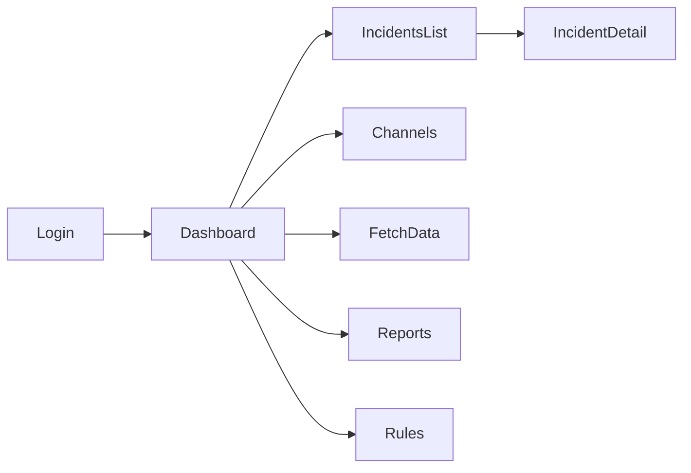

# 設計文書（インシデント管理システム）

## プロジェクト情報
- **プロジェクト名**: インシデント管理システム
- **バージョン**: 1.0.0
- **作成日**: 2025-08-24
- **更新日**: 2025-08-24

## 1. システム構成

### 1.1 全体アーキテクチャ
- Next.js App Router を用いたフルスタック構成（同一リポジトリにUIとAPIを集約）
- APIはすべてサーバーサイド（Route Handlers）で実行し、クライアントから外部APIを直接呼ばない
- Neon（PostgreSQL）に永続化。Slackメッセージは生データ(JSONB)で保存
- 取得・分析ワーカーはサーバーサイドで逐次実行（Vercel cron/On-Demand ISR 相当のキックで十分）
- 自動判定エンジン（緊急度/影響度）はサーバーサイドでルール評価→DB保存、手動上書き可能

構成要素:
- Web/UI: Next.js (app/)
- API: Next.js Route Handlers (app/api/*)
- DB: Neon (PostgreSQL)
- 認証: 資格情報ベース（メール+パスワード）
- Slack連携: Slack Web API（conversations.history, conversations.replies）

### 1.2 技術スタック
- Next.js 14+ / TypeScript
- PostgreSQL (Neon)
- Prisma（予定: DBスキーマ管理と型安全なアクセス）
- 認証: NextAuth Credentials Provider 予定（サーバーサイドのみで使用）
- UI: WCAG 2.2 AA 準拠のコンポーネント（フォーム、表、フィルタ、モーダル）

### 1.3 デプロイメント構成
- Vercel（フロント+サーバールート）
- Neon（マネージドPostgreSQL）
- 環境変数: SLACK_BOT_TOKEN, DATABASE_URL, AUTH_SECRET など（すべてVercel環境変数で管理）
- 定期取得: VercelのScheduled Functions（必要時）

## 2. データベース設計

### 2.1 ER図
```mermaid
erDiagram
    users ||--o{ incidents : assigns
    channels ||--o{ slack_messages : has
    channels ||--o{ incidents : groups
    slack_messages ||--o{ incidents : derived_from
    urgency_rules ||--o{ incidents : evaluates
    impact_rules ||--o{ incidents : evaluates

    users {
      uuid id PK
      text email
      text hashed_password
      timestamptz created_at
      timestamptz updated_at
    }
    channels {
      uuid id PK
      text slack_channel_id
      text name
      boolean enabled
      timestamptz created_at
      timestamptz updated_at
    }
    slack_messages {
      uuid id PK
      uuid channel_id FK
      text slack_ts
      jsonb raw
      timestamptz posted_at
      timestamptz fetched_at
      unique(slack_ts, channel_id)
    }
    incidents {
      uuid id PK
      uuid channel_id FK
      uuid message_id FK
      text title
      text status  // open, in_progress, resolved
      text urgency // high, medium, low
      text impact  // high, medium, low
      text level   // outage or bug
      boolean overridden  // 手動上書きの有無
      text assignee_user_id
      text memo
      timestamptz created_at
      timestamptz updated_at
    }
    fetch_history {
      uuid id PK
      uuid channel_id FK
      timestamptz range_from
      timestamptz range_to
      integer fetched_count
      integer api_calls
      text status // success, rate_limited, failed
      text error_message
      timestamptz created_at
    }
    urgency_rules {
      uuid id PK
      text name
      text pattern  // 正規表現
      text priority // high, medium, low にマップ
      boolean enabled
      timestamptz created_at
      timestamptz updated_at
    }
    impact_rules {
      uuid id PK
      text name
      text pattern  // 正規表現
      text scope    // high, medium, low にマップ
      boolean enabled
      timestamptz created_at
      timestamptz updated_at
    }
```

### 2.2 テーブル定義（要点）
- users(email unique, hashed_password)
- channels(slack_channel_id unique, name, enabled)
- slack_messages(channel_id, slack_ts unique複合, raw jsonb, posted_at)
- incidents(urgency, impact は enum相当; level は rules: 中以上 or 影響度高 → outage、それ以外は bug)
- urgency_rules/impact_rules(pattern は正規表現文字列、enabledで有効化制御)
- fetch_history(レンジ・件数・APIコール数・結果)

### 2.3 インデックス設計
- slack_messages: (channel_id, posted_at DESC), (channel_id, slack_ts UNIQUE)
- incidents: (status), (level), (urgency), (impact), (created_at DESC)
- channels: (enabled), (slack_channel_id UNIQUE)
- rules: (enabled)

## 3. API設計

すべてサーバーサイドのRoute Handlerで提供。クライアントから外部API（Slack）を直接呼ばない。

### 3.1 エンドポイント一覧（内部API）
- POST `/api/auth/login`
- POST `/api/auth/logout`
- GET `/api/channels`
- POST `/api/channels`
- PATCH `/api/channels/:id`
- DELETE `/api/channels/:id`
- POST `/api/slack/fetch` 期間指定 {channelId, from, to}
- GET `/api/incidents` クエリ: q, from, to, urgency, impact, level, status, page
- GET `/api/incidents/:id`
- PATCH `/api/incidents/:id`（緊急度/影響度の手動変更、担当者、ステータス、メモ）
- GET `/api/reports/summary`（期間別/レベル別集計）
- GET `/api/reports/export`（CSV）
- GET `/api/rules`（urgency/impact 一覧）
- POST `/api/rules`（追加）
- PATCH `/api/rules/:id`（更新）
- DELETE `/api/rules/:id`

### 3.2 API仕様詳細（抜粋）
- POST `/api/slack/fetch`
  - body: { channelId: string, from: string(ISO), to: string(ISO) }
  - 200: { fetchedCount: number, apiCalls: number }
  - 429: { message: "rate limited", retryAfter?: number }

- PATCH `/api/incidents/:id`
  - body: { urgency?: "high"|"medium"|"low", impact?: "high"|"medium"|"low", status?: "open"|"in_progress"|"resolved", assigneeUserId?: string, memo?: string }
  - 200: { ...incident }

### 3.3 認証・認可
- 認証: メール+パスワード（シード済ユーザーのみ）
- セッション: サーバーサイドで検証
- 認可: API全エンドポイントでセッション必須。管理操作（チャンネルCRUD、ルールCRUD）は管理ロール想定（単一ロール前提のため、管理操作は限定UIからのみ可能）

## 4. 画面設計

### 4.1 画面遷移図


### 4.2 画面一覧
- ログイン: メール/パスワード
- ダッシュボード: 本日の新規、未対応、レベル別集計
- チャンネル管理: 追加/有効無効/削除
- データ取得: 期間指定で取得実行（進捗/結果表示）
- インシデント一覧: フィルタ（期間/緊急度/影響度/レベル/ステータス/キーワード）
- インシデント詳細: 元Slack表示、緊急度/影響度の手動上書き、担当者、メモ、履歴
- レポート: 期間推移/分布/CSV出力
- 判定ルール設定: ルールCRUD、プレビュー

### 4.3 画面詳細（WCAG2.2配慮）
- キーボード操作対応、明確なフォーカスリング
- コントラスト比 AA 準拠
- フォームは関連ラベルとエラーメッセージを関連付け（aria-describedby）
- テーブルはヘッダ関連付け（scope/aria）とページネーション

## 5. モジュール設計

### 5.1 ディレクトリ構成（想定）
```
src/
  app/
    (auth)/login/page.tsx
    dashboard/page.tsx
    incidents/page.tsx
    incidents/[id]/page.tsx
    channels/page.tsx
    fetch/page.tsx
    reports/page.tsx
    rules/page.tsx
    api/
      auth/login/route.ts
      auth/logout/route.ts
      channels/route.ts
      channels/[id]/route.ts
      slack/fetch/route.ts
      incidents/route.ts
      incidents/[id]/route.ts
      reports/summary/route.ts
      reports/export/route.ts
      rules/route.ts
      rules/[id]/route.ts
  lib/
    db.ts
    auth.ts
    slack/
      client.ts
      fetch.ts
      rateLimit.ts
    incidents/
      classify.ts
      rules.ts
      level.ts
    validation/
      schemas.ts
```

### 5.2 主要関数（概要）
- classifyUrgency(messageText: string): "high"|"medium"|"low"
- classifyImpact(messageText: string): "high"|"medium"|"low"
- determineIncidentLevel(urgency, impact): "outage"|"bug"
- fetchChannelMessages(channelId, from, to): { messages, apiCalls }
- saveSlackRaw(message): void // JSONBに保存
- upsertIncidentFromMessage(message): incident

### 5.3 データフロー（取得〜分析）
1. ユーザーが期間を指定し取得実行
2. サーバーがSlack APIをページングで呼び出し、rateLimit.tsでバックオフ制御
3. メッセージ/スレッドをraw(JSONB)で保存
4. classify.ts がルールに基づき緊急度/影響度を算出
5. level.ts でレベル（障害/不具合）を決定
6. incidents に保存（手動上書きがあれば overridden=true）

## 6. セキュリティ設計

### 6.1 認証方式
- メール+パスワード（bcryptハッシュ）
- セッションはHTTP-onlyクッキー

### 6.2 認可方式
- ログイン必須。管理操作は限定UIからのみ許可

### 6.3 データ保護
- 環境変数で機密情報管理
- SlackトークンはKMS同等で暗号化保存（Neon上は暗号化列/アプリ層暗号）
- CSRF対策、XSS対策、SQLインジェクション防止

## 7. エラーハンドリング

### 7.1 エラー分類
- Slack API関連（429, 4xx, 5xx）
- DB関連
- 認証/認可関連
- 入力検証エラー

### 7.2 処理方針
- 429: Exponential backoff + 再試行、fetch_historyに記録
- 4xx: 入力見直しを促すエラー返却
- 5xx/DB: ログ集約しユーザー向けは汎用メッセージ

## 8. テスト設計

### 8.1 方針
- TDDで分類ロジックを優先的にテスト
- APIは統合テストでルール/保存/検索まで確認

### 8.2 レベル
- 単体: classify/level/validation
- 統合: fetch → 保存 → 分類 → 検索
- E2E: ログイン→取得→一覧→詳細→上書き→レポート

### 8.3 環境
- Node 18+、NeonテストDB、Slack APIはモック
