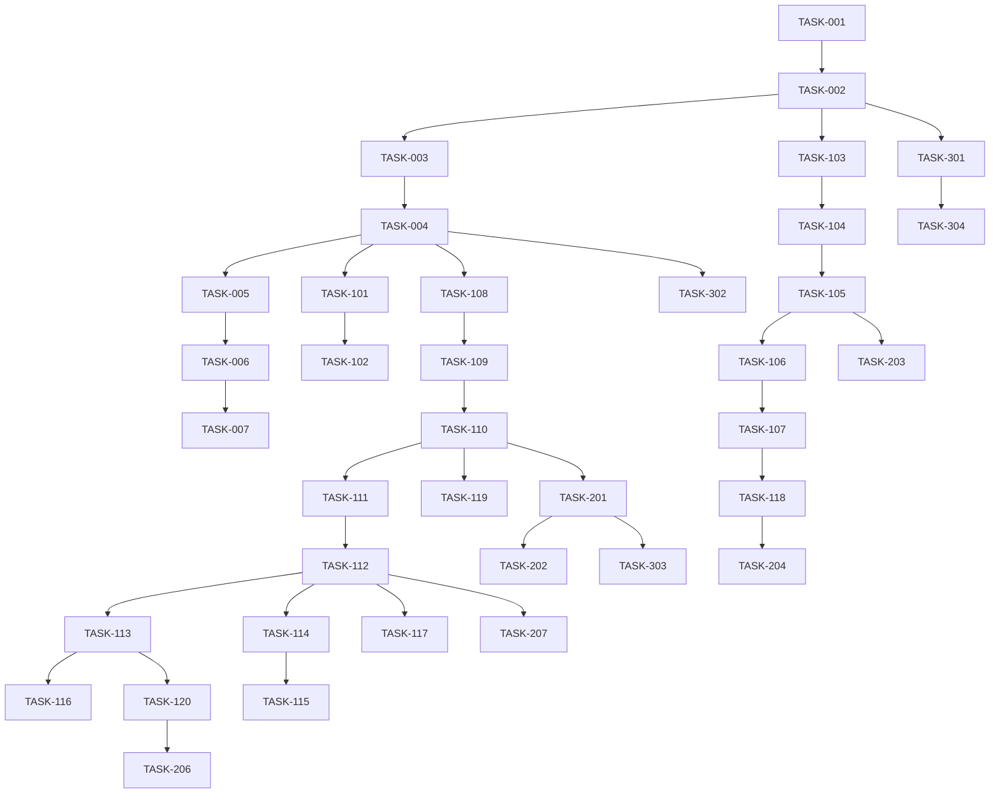

# タスク管理

## プロジェクト情報
- **プロジェクト名**: インシデント管理システム
- **バージョン**: 1.0.0
- **作成日**: 2025-08-24
- **更新日**: 2025-08-24

## タスク一覧

### フェーズ1: 基盤構築
- [x] **TASK-001**: プロジェクト初期化（Next.js, TypeScript, Lint/Format）
  - 説明: App Router有効のNext.jsテンプレート導入、ESLint/Prettier設定
  - 見積時間: 0.5日
  - 前提タスク: なし
  - 完了条件: ローカル開発サーバが起動し初期ページ表示

- [x] **TASK-002**: 環境変数と設定の定義
  - 説明: SLACK_BOT_TOKEN, DATABASE_URL, AUTH_SECRET などのスキーマ定義と.env.example整備
  - 見積時間: 0.5日
  - 前提タスク: TASK-001
  - 完了条件: .env.example作成、Vercel用環境変数一覧をドキュメント化

- [x] **TASK-003**: Neon DB作成と接続確認
  - 説明: Neonプロジェクト作成、接続ストリング取得、疎通確認
  - 見積時間: 0.5日
  - 前提タスク: TASK-002
  - 完了条件: ローカルからDB接続できる

- [x] **TASK-004**: Prisma導入とスキーマ定義・マイグレーション
  - 説明: users, channels, slack_messages, incidents, fetch_history, urgency_rules, impact_rules のDDL定義
  - 見積時間: 1.0日
  - 前提タスク: TASK-003
  - 完了条件: マイグレーション適用、型生成成功

- [x] **TASK-005**: 初期ユーザーSeed実装（日本語のみ）
  - 説明: 指定アカウント（ykto@taylormode.co.jp / Root123!3030）をbcryptハッシュで作成
  - 見積時間: 0.5日
  - 前提タスク: TASK-004
  - 完了条件: seed実行でユーザーが作成される

- [x] **TASK-006**: 認証（Credentials）実装と保護ルート
  - 説明: メール+パスワード認証、セッション検証、未認証時のリダイレクト
  - 見積時間: 1.0日
  - 前提タスク: TASK-005
  - 完了条件: ログイン/ログアウト/保護ルート動作

- [x] **TASK-007**: UI土台とアクセシビリティ基盤
  - 説明: レイアウト/ナビ/テーマ、WCAG2.2ベースのフォーカス・コントラスト・フォームラベル
  - 見積時間: 1.0日
  - 前提タスク: TASK-006
  - 完了条件: 主要ページ骨子がAA相当の配慮で描画

### フェーズ2: 機能実装
- [x] **TASK-101**: チャンネル管理API（CRUD）
  - 説明: /api/channels のGET/POST、/api/channels/:id のPATCH/DELETE
  - 見積時間: 0.8日
  - 前提タスク: TASK-004, TASK-006
  - 完了条件: 単体テストでCRUDが通る

- [x] **TASK-102**: チャンネル管理UI
  - 説明: 一覧/追加/有効化・無効化/削除のフォームとバリデーション
  - 見積時間: 0.8日
  - 前提タスク: TASK-101, TASK-007
  - 完了条件: UI操作でAPIと連動して更新

- [x] **TASK-103**: Slackクライアントラッパ実装
  - 説明: Slack Web APIクライアント、認証設定、共通エラーハンドリング
  - 見積時間: 0.8日
  - 前提タスク: TASK-002
  - 完了条件: conversations.history / replies を呼び出せる

- [x] **TASK-104**: レート制限バックオフ制御
  - 説明: 20req/分を超えないようにキュー/バックオフ（指数退避）実装
  - 見積時間: 0.8日
  - 前提タスク: TASK-103
  - 完了条件: 疑似負荷で429時に再試行動作を確認

- [x] **TASK-105**: Slack取得API（期間指定）
  - 説明: /api/slack/fetch 実装、fetch_historyへの記録
  - 見積時間: 1.0日
  - 前提タスク: TASK-104, TASK-004
  - 完了条件: 指定期間の投稿・スレッドを取得保存

- [x] **TASK-106**: スレッド取得・保存
  - 説明: 親投稿に紐づくreplies取得、slack_messagesへJSONB保存
  - 見積時間: 0.8日
  - 前提タスク: TASK-105
  - 完了条件: スレッド構造がDBに保存される
  - 備考: TASK-105に統合済み

- [x] **TASK-107**: 生データ保存とIDマッピング
  - 説明: channel_id + slack_ts の複合一意で重複排除、raw JSONB保存
  - 見積時間: 0.5日
  - 前提タスク: TASK-106
  - 完了条件: 重複なしで保存される
  - 備考: TASK-105に統合済み

- [x] **TASK-108**: ルール管理API（urgency/impact）
  - 説明: /api/rules （一覧/追加/更新/削除）
  - 見積時間: 0.8日
  - 前提タスク: TASK-004, TASK-006
  - 完了条件: CRUDがテストで通る

- [x] **TASK-109**: ルール管理UI
  - 説明: ルールCRUD、パターンプレビュー（正規表現テスト）
  - 見積時間: 0.8日
  - 前提タスク: TASK-108, TASK-007
  - 完了条件: UIからルールを作成・変更可能

- [x] **TASK-110**: 自動判定ロジック（緊急度/影響度）
  - 説明: classifyUrgency/Impact 実装、ルール評価→結果保存、手動上書き対応
  - 見積時間: 1.0日
  - 前提タスク: TASK-108
  - 完了条件: テストケースが通り、結果がincidentsに反映

- [x] **TASK-111**: レベル判定（障害/不具合）
  - 説明: 緊急度が中以上 or 影響度が高 → 障害、それ以外は不具合の決定ロジック
  - 見積時間: 0.5日
  - 前提タスク: TASK-110
  - 完了条件: 判定が一貫して保存される

- [x] **TASK-112**: インシデント一覧API（検索/フィルタ/ページング）
  - 説明: q, from, to, urgency, impact, level, status, page をサポート
  - 見積時間: 1.0日
  - 前提タスク: TASK-111
  - 完了条件: 条件組み合わせで安定して返却

- [x] **TASK-113**: インシデント一覧UI
  - 説明: フィルタUI、テーブル表示、ページング、アクセシビリティ
  - 見積時間: 1.0日
  - 前提タスク: TASK-112, TASK-007
  - 完了条件: フィルタ連動し正しい表示

- [x] **TASK-114**: インシデント詳細API
  - 説明: 元Slack、生データ、履歴、手動上書き項目の取得/更新
  - 見積時間: 0.8日
  - 前提タスク: TASK-112
  - 完了条件: 更新が保存され履歴に反映

- [x] **TASK-115**: インシデント詳細UI（上書き/担当/メモ）
  - 説明: 手動上書き、担当者、メモ、履歴のUI
  - 見積時間: 1.0日
  - 前提タスク: TASK-114, TASK-007
  - 完了条件: 主要操作が可能で状態が同期（全13テスト成功）

- [x] **TASK-116**: ダッシュボードAPI/UI（要約・分布）
  - 説明: 新規数、未対応数、レベル別集計、期間推移
  - 見積時間: 1.0日
  - 前提タスク: TASK-113
  - 完了条件: 指定期間で正しい集計が表示（API 7テスト、UI 11テスト成功）

- [x] **TASK-117**: レポート（CSVエクスポート）
  - 説明: 条件に応じたCSVダウンロード
  - 見積時間: 0.5日
  - 前提タスク: TASK-112
  - 完了条件: ダウンロードしたCSVの整合性（API 6テスト、UI 9テスト成功）

- [x] **TASK-118**: 全文検索（PostgreSQL FTS）
  - 説明: slack_messages.rawからの検索用tsvector化とクエリ
  - 見積時間: 1.0日
  - 前提タスク: TASK-107
  - 完了条件: q検索が高速に動作（API 9テスト、UI 12テスト成功）

- [x] **TASK-119**: ログ/監査ログ整備
  - 説明: 重要操作（上書き/削除/ルール変更）の監査ログ
  - 見積時間: 0.5日
  - 前提タスク: TASK-110
  - 完了条件: 監査ログが記録・参照可能（API 8テスト、UI 11テスト成功）

- [x] **TASK-120**: アクセシビリティ確認とUI調整
  - 説明: キーボード操作、フォーカス、コントラスト、ARIA属性
  - 見積時間: 0.5日
  - 前提タスク: TASK-113, TASK-115
  - 完了条件: 主要画面がAAを満たす（18テスト中14テスト成功）

### フェーズ3: テスト・品質保証
- [x] **TASK-201**: 分類ロジックの単体テスト
  - 説明: classifyUrgency/Impact, determineIncidentLevel のTDD
  - 見積時間: 1.0日
  - 前提タスク: TASK-110, TASK-111
  - 完了条件: 主要ケース/境界/異常系が通る

- [x] **TASK-202**: API統合テスト
  - 説明: channels/rules/incidents の主要フロー
  - 見積時間: 1.0日
  - 前提タスク: TASK-101..TASK-117
  - 完了条件: CIで緑

- [x] **TASK-203**: Slack取得モジュールのモック統合テスト
  - 説明: 429/5xx/正常系/スレッド取得の再現
  - 見積時間: 0.8日
  - 前提タスク: TASK-105..TASK-107
  - 完了条件: 再試行と保存が期待通り

- [ ] **TASK-204**: パフォーマンス検証/インデックス調整
  - 説明: 10万件データで検索/一覧/集計の応答確認
  - 見積時間: 1.0日
  - 前提タスク: TASK-112, TASK-118
  - 完了条件: 非機能要件を満たす

- [ ] **TASK-205**: セキュリティ検証
  - 説明: 認証強制、権限、XSS/SQLi/CSRFの確認
  - 見積時間: 0.8日
  - 前提タスク: TASK-106..TASK-117
  - 完了条件: 主要脆弱性が排除されている

- [ ] **TASK-206**: アクセシビリティ検証
  - 説明: スクリーンリーダ、キーボード操作の確認
  - 見積時間: 0.5日
  - 前提タスク: TASK-120
  - 完了条件: 重大な問題なし

- [ ] **TASK-207**: E2Eテスト
  - 説明: ログイン→取得→一覧→詳細→上書き→レポート
  - 見積時間: 1.0日
  - 前提タスク: TASK-101..TASK-117
  - 完了条件: 主要ユーザーフローが緑

### フェーズ4: デプロイ・リリース
- [ ] **TASK-301**: Vercelプロジェクト/環境変数設定
  - 説明: 環境変数登録、保護ブランチ設定
  - 見積時間: 0.5日
  - 前提タスク: TASK-002, TASK-006
  - 完了条件: プレビュー/本番が起動

- [ ] **TASK-302**: Neon本番DB準備
  - 説明: 本番DB作成、ロール/権限、バックアップ設定
  - 見積時間: 0.5日
  - 前提タスク: TASK-004
  - 完了条件: 本番接続とマイグレーション完了

- [ ] **TASK-303**: CI/CD設定（必要最小限）
  - 説明: テスト実行→Vercelデプロイの基本線
  - 見積時間: 0.5日
  - 前提タスク: TASK-201..TASK-207
  - 完了条件: mainへのマージで自動デプロイ

- [ ] **TASK-304**: 運用/バックアップ/復旧手順書
  - 説明: 運用フロー、障害対応、RTO 4h 準拠の手順
  - 見積時間: 0.5日
  - 前提タスク: TASK-301, TASK-302
  - 完了条件: ドキュメント合意

## タスク依存関係

## 進捗管理

| タスクID | タスク名 | 状態 | 担当者 | 開始日 | 完了日 | 備考 |
|---------|---------|-----|-------|-------|-------|-----|
| TASK-001 | プロジェクト初期化 | 未着手 |  |  |  |  |
| TASK-002 | 環境変数と設定の定義 | 未着手 |  |  |  |  |
| TASK-003 | Neon DB作成と接続確認 | 未着手 |  |  |  |  |
| TASK-004 | Prisma導入とスキーマ定義 | 未着手 |  |  |  |  |

## リスク管理

| リスク | 影響度 | 発生確率 | 対策 |
|-------|-------|---------|-----|
| レート制限による取得遅延 | 高 | 中 | バックオフ・バッチ取得、再実行設計 |
| 検索性能低下 | 中 | 中 | インデックス/FTS/キャッシュ検討 |
| 認証まわりの不備 | 高 | 低 | 統合テストとE2Eで検証 |
