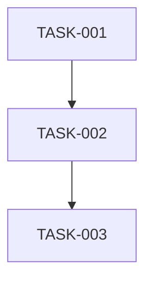

# タスク管理テンプレート

## プロジェクト情報
- **プロジェクト名**: 
- **バージョン**: 
- **作成日**: 
- **更新日**: 

## タスク一覧

### フェーズ1: 基盤構築
- [ ] **TASK-001**: プロジェクト初期化
  - 説明: 
  - 見積時間: 
  - 前提タスク: なし
  - 完了条件: 

### フェーズ2: 機能実装
- [ ] **TASK-XXX**: 
  - 説明: 
  - 見積時間: 
  - 前提タスク: 
  - 完了条件: 

### フェーズ3: テスト・品質保証
- [ ] **TASK-XXX**: 
  - 説明: 
  - 見積時間: 
  - 前提タスク: 
  - 完了条件: 

### フェーズ4: デプロイ・リリース
- [ ] **TASK-XXX**: 
  - 説明: 
  - 見積時間: 
  - 前提タスク: 
  - 完了条件: 

## タスク依存関係

## 進捗管理

| タスクID | タスク名 | 状態 | 担当者 | 開始日 | 完了日 | 備考 |
|---------|---------|-----|-------|-------|-------|-----|
| TASK-001 |         | 未着手 |       |       |       |     |

## リスク管理

| リスク | 影響度 | 発生確率 | 対策 |
|-------|-------|---------|-----|
|       |       |         |     |
